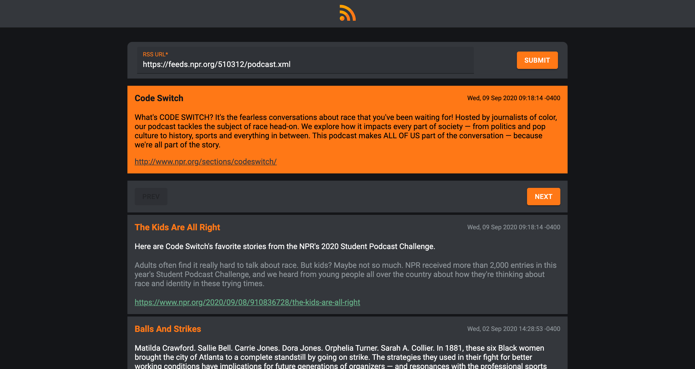

# RSS Parser
A simple rss parser

	

## Content
- [X] Custom JS methods:
  - Array.prototype.map
  - Array.prototype.filter
  - Array.prototype.reduce
- [X] UI contains: Form (Input + Submit button), List of items, Pagination
- [X] Form Input allows users to input an RSS Feed URL
- [X] Form Submit Button fetches provided RSS-feed, then parses it and uses it in List
- [X] Validations: In case of any error, UI should show something to the user

## Libraries and Frameworks

#### External 
- [X] [Create React App](https://github.com/facebook/create-react-app)
- [X] [Redux Toolkit](https://redux-toolkit.js.org/)
- [X] [Redux Devtools Extension](https://github.com/zalmoxisus/redux-devtools-extension)
- [X] [Material-UI](https://material-ui.com/)
- [X] [FontAwesome](https://fontawesome.com/)
- [X] [Jest Fetch Mock](https://github.com/jefflau/jest-fetch-mock/)

## Information
Check [React-Seed](https://github.com/imransilvake/React-Seed) to understand how to build and serve this project as well as how to use SCSS and JS linting.
